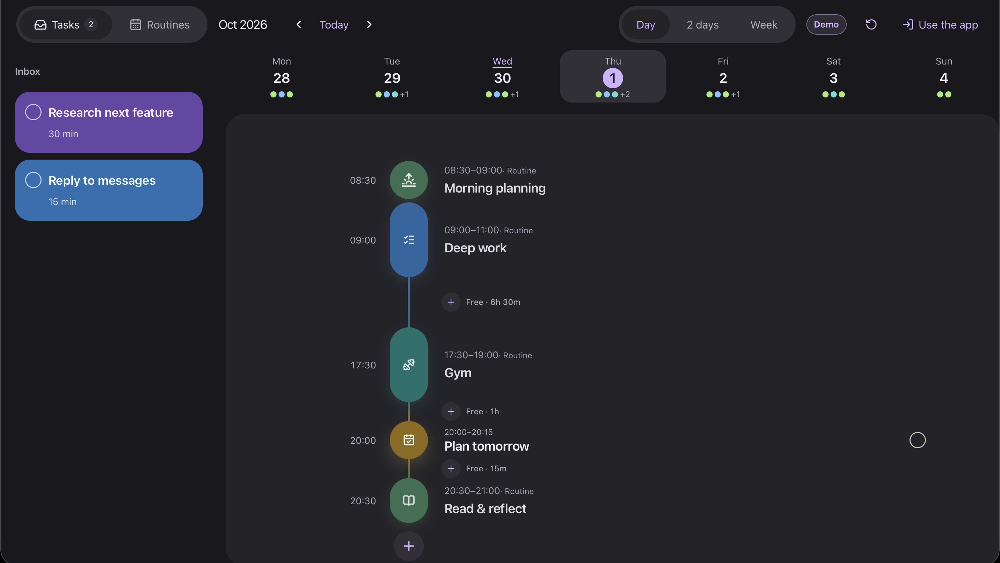
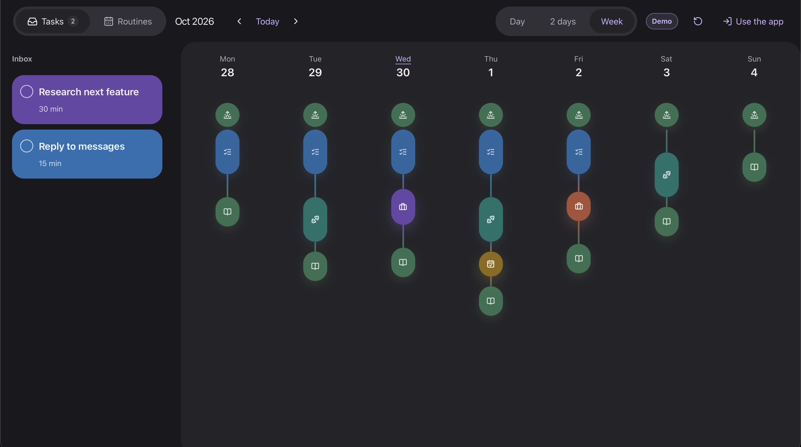
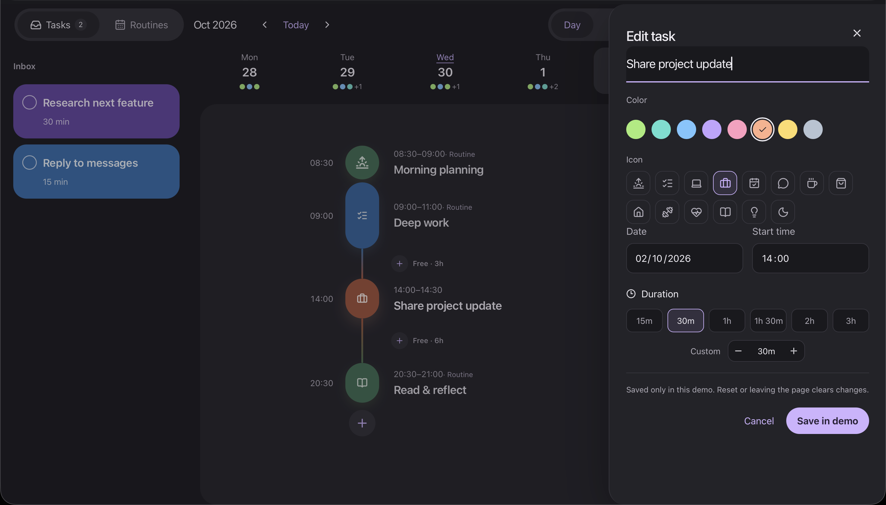

# DayFlow — Plan tomorrow tonight

DayFlow is a personal daily planner for making a calm plan tonight and following it tomorrow. It combines an Inbox, a visual timetable, recurring weekly routines, and fast Day / 2 days / Week views.

**Live app:** [day-flow-plan.vercel.app](https://day-flow-plan.vercel.app)
**Explore the demo:** [day-flow-plan.vercel.app/demo](https://day-flow-plan.vercel.app/demo)



## Live demo

Open [/demo](https://day-flow-plan.vercel.app/demo) to explore a complete sample plan without creating an account. Demo tasks and routines are generated around the viewer’s current date, and every change resets when the visitor leaves the page. Create an account to save personal data.

## Highlights

### Plan the whole week



### Edit tasks without losing your place



## What DayFlow does

- Email/password authentication, email confirmation, password reset, and account settings
- Inbox tasks with title, notes, color, duration, completion, and deletion
- Schedule tasks in the timetable, edit them, or return them to Inbox
- Drag tasks between Inbox and timetable; drag scheduled tasks to a new time
- Immediate UI updates with background server confirmation, Undo, browser-tab sync, and Supabase realtime updates
- Day, 2 days, and Week views with URL-based navigation
- Weekly routines with chosen weekdays, start date, optional end date, start time, duration, and notes
- Responsive desktop and mobile UI, dark/light/system appearance, and PWA install support

## Stack

- Next.js App Router, React, TypeScript
- Supabase Auth, PostgreSQL, Row Level Security, and Realtime
- dnd-kit, date-fns, Zod, Radix UI, Lucide
- Vercel deployment and pnpm

## Local setup

**Requirements:** Node.js 24, pnpm 10, and a Supabase project.

```sh
pnpm install --frozen-lockfile
cp .env.example .env.local
pnpm dev
```

Open [http://localhost:3000](http://localhost:3000). Restart the development server after changing `.env.local`.

### Environment variables

```env
NEXT_PUBLIC_SUPABASE_URL=
NEXT_PUBLIC_SUPABASE_PUBLISHABLE_KEY=
```

These browser-safe values identify the Supabase project. Do not add a service-role key, database password, or Supabase access token to `.env.local` or to Vercel’s public variables. RLS protects each user’s rows.

## Database and Supabase

Link the CLI once, then use migration files as the database source of truth:

```sh
pnpm exec supabase login
pnpm exec supabase link --project-ref YOUR_PROJECT_REF
pnpm exec supabase db push
```

After deployment, set the Supabase **Site URL** to the production domain and add the same domain to **Redirect URLs**. The email-confirmation template should link to:

```html
<a href="{{ .SiteURL }}/auth/confirm?token_hash={{ .TokenHash }}&type=email">
  Confirm your email
</a>
```

For local Supabase development (Docker required):

```sh
pnpm db:start
pnpm db:reset
pnpm db:types
pnpm db:stop
```

`pnpm db:reset` only resets the local database. Never use it for production data.

## Quality checks

```sh
pnpm lint
pnpm typecheck
pnpm test
pnpm test:db
pnpm build
```

`pnpm check` runs the lint, type, unit, and database checks together. `pnpm build` is the final production-build verification.

## Deploying to Vercel

1. Push the repository to GitHub. A private repository works.
2. Import the repository into Vercel with the Next.js preset.
3. Set Node.js 24, `pnpm install --frozen-lockfile` as the install command, and `pnpm build` as the build command.
4. Add `NEXT_PUBLIC_SUPABASE_URL` and `NEXT_PUBLIC_SUPABASE_PUBLISHABLE_KEY` for Production and Preview as appropriate.
5. Apply pending Supabase migrations with `pnpm exec supabase db push`.
6. Update Supabase Auth Site URL and Redirect URLs to the deployed domain.
7. Smoke-test signup, password reset, planner navigation, drag/drop, routines, and a second browser tab before release.

## Project map

```text
src/app/                     Routes and authenticated server actions
src/components/auth/         Login, signup, confirmation, and password recovery
src/components/planner/      Planner UI, editor components, and planner hooks
src/lib/tasks/               Schedule, routines, colors, and agenda utilities
src/lib/supabase/            Browser and server Supabase clients
src/lib/validation/          Zod schemas for server actions
supabase/migrations/         Versioned schema, policies, realtime, and planner data
scripts/test-rls.mjs         Database/RLS isolation checks
tests/                       Unit tests
public/                      PWA manifest, icons, and offline fallback
```

See [V1 product scope](docs/V1-BLUEPRINT.md) and [architecture & operations](docs/ARCHITECTURE.md) for product rules, data flow, and maintenance guidance.
